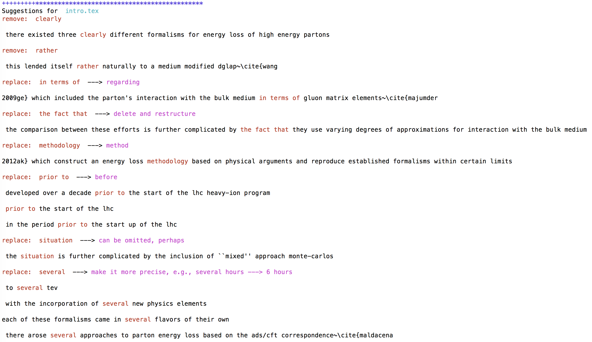

# proofread

庞龙刚，UC Berkeley 物理系
lgpang@qq.com

这是一个个人开源项目，目的是对科学文章草稿自动检查，寻找不符合英文科学写作标准的部分，并提出修改意见。

目前实现的功能如下：
1. 建议替换复杂词，不准确词，删除多余词
2. 语法检查，单词拼写检查（使用在线API，请人工复检修改建议）
3. 寻找主语太长或主语前限定词太多的语句
4. 寻找主语与谓语之间距离过远，被中断的语句
5. 寻找名词词串

## 使用方法
在命令行输入如下命令，下载并运行
```bash
git clone https://gitlab.com/snowhitiger/proofread.git
cd proofread
python proofread.py path/*.tex
```
其中星号代表任何文件名, 或星号匹配的所有文件，运行proofread.py输出结果如下:


在默认情况下，proofread.py 仅对规则字典中要求删除或替换的词进行检查。
如果想要开启其他功能，可以在命令行添加选项。
```bash
python proofread.py --help
```
> usage: proofread.py [-h] [--report_long_subjects] [--report_interruptions]
>                     [--report_noun_clusters] [--check_grammars] [--brief]
>                     f [f ...]
> 
> Proofread scientific papers to make it brief and simple
> 
> positional arguments:
>   f                     one file or a list of files for analysis
> 
> optional arguments:
>
>   -h, --help            show this help message and exit
>
>   --report_long_subjects
>                         Principle 10: avoid long subjects or many words before
>                         the subject. Default=False
>
>   --report_interruptions
>                         Principle 11: avoid interruptions between subject and
>                         verb and between verb and object. Default=False
>
>   --report_noun_clusters
>                         Principle 18: avoid noun clusters. Default=False
>
>   --check_grammars      Check grammar using online api ginger. Default=False
>
>   --brief               turn off output for the original sentence

示例，如果想对文件 example.tex 开启语法检查, 并报告过长的主语，使用
```bash
python proofread.py example.tex --report_long_subjects --check_grammars
```

## 基于规则的替换建议
在英文科学写作中，会有很多明确的规则，以使文章更清晰，明了，面向大众。
这个项目的最初版本会基于规则，对出现的特定词组建议替换或删除。
举例说明几个简单的规则：

1. "As it is well known"：建议删除。
2. "It is shown that": 建议删除。
3. "is related to": 建议修改成 "is associated with"。
4. "provides a review": 建议修改成 "reviews"。

这些规则会有很多变体，比如 "As it is well known" 在文章中可能表现为 "As it has been well know" 或者 
"As it was well known"。基于规则的这部分会尽量考虑所有的可能并提出相应的替换方案。

rule1to6\_words.py 实现了所有词的替换和删除建议。直接运行 proofread.py 会默认使用定义在此脚本中的所有规则。

## 基于自然语言处理的语法判断和语义分析
### 避免主语太长或者主语之前有过多的限定词

写作的过程应尽量使主语简短，接近谓语，否则会带来理解上的困难。这是《Scientific Writing And Communication》书中提到的第10条科学写作原则。
举例说明：

:thumbsdown: Due to the nonlinear and hence complex nature of ocean currents,
modeling these currents in the tropical pacific is difficult.

:thumbsup: Modeling ocean currents in the tropical Pacific is difficult 
due to their nonlinear and hence complex nature.

目前使用Spacy库对文章的每句话进行语法分析，找到主语谓语。如果谓语之前的主语过长，则提出修改请求。

rule10\_long\_subject.py 实现对文章的每句话进行依存分析，寻找谓语，并判断其之前的主语部分是否过长，影响理解。如果过长，则建议修改。

proofread.py 默认不会对主语过长进行检查，需要在命令行中加入选项开启，

```bash
python proofread.py example.txt --report_long_subjects
```
如果 Spycy 库没有安装，第一次开启了 --report\_long\_subjects 之后，python会自动调用命令
```bash
pip install spycy --user
``` 
安装spycy 并下载其需要的英文语法库。

如果想降低Tex指令对proofread.py造成的影响，可以使用 pandoc，将tex格式转化为Markdown格式，命令如下，
```bash
pandoc example.tex -o example.txt
```

### 其余基于语义的规则
ToDo:
有些需要语义判断的地方，可能会用到自然语言处理。比如 Since 一般被用作与时间相关的语句，但有时候它也会被
用作 “because”，如果我们想将所有与时间无关的用例都替换成 "because" 或者 "as", 那么就需要使用一定
的机器学习或人工智能，来判断语句是否表达了自某一时刻起。

自然语言处理的方法，可以是简单的隐马尔可夫链/条件随机场，可以是复杂点的RNN，也可以是更复杂的BERT。

训练语料可以通过将文章中的 because 替换成 since，作为训练样例。


## 规则资源

* [Scientific Writing and Communication: Papers, Proposals, and Presentations 3rd Edition](https://www.amazon.com/Scientific-Writing-Communication-Proposals-Presentations/dp/0190278544/ref=sr_1_1?crid=LL6BK57HDFO4&keywords=scientific+writing+and+communication&qid=1555175104&s=gateway&sprefix=scientific+writting+%2Caps%2C183&sr=8-1)
* [Duke: Scientific Writting Resource](https://cgi.duke.edu/web/sciwriting/index.php?action=lesson3)
